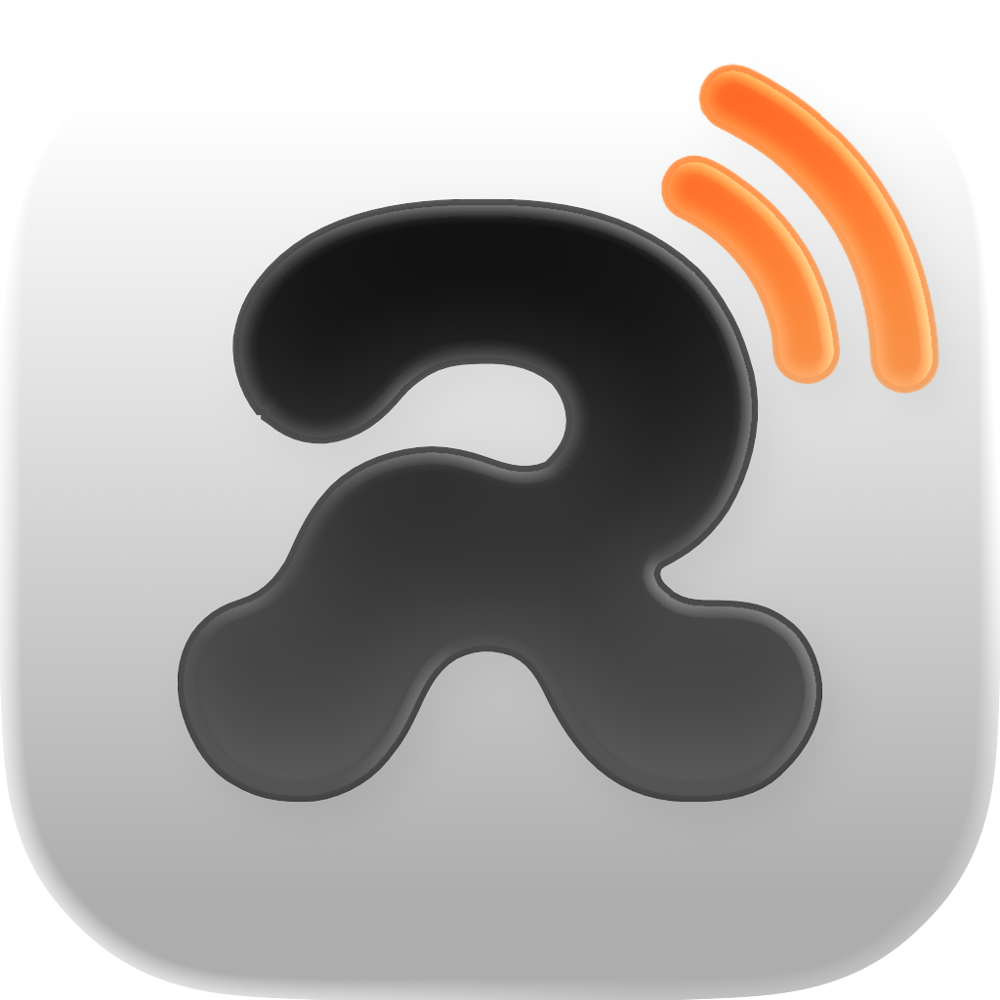
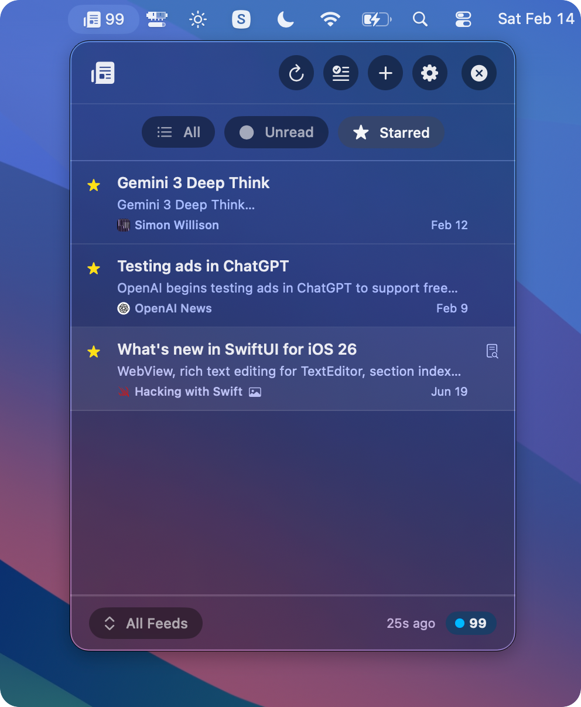
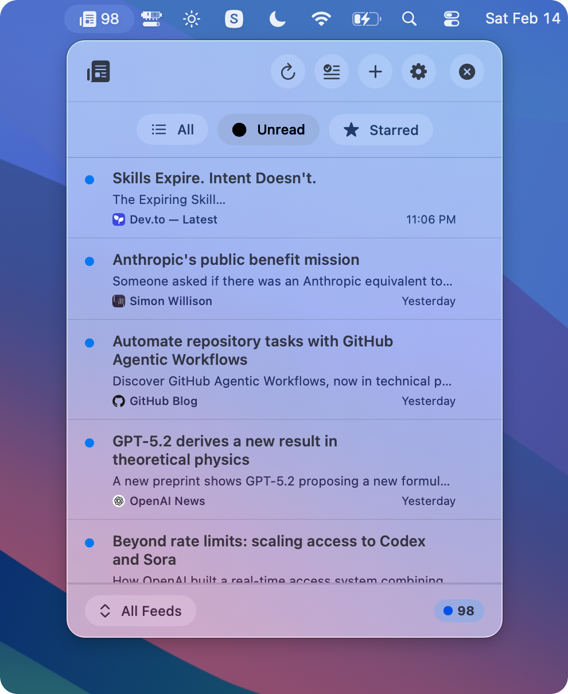
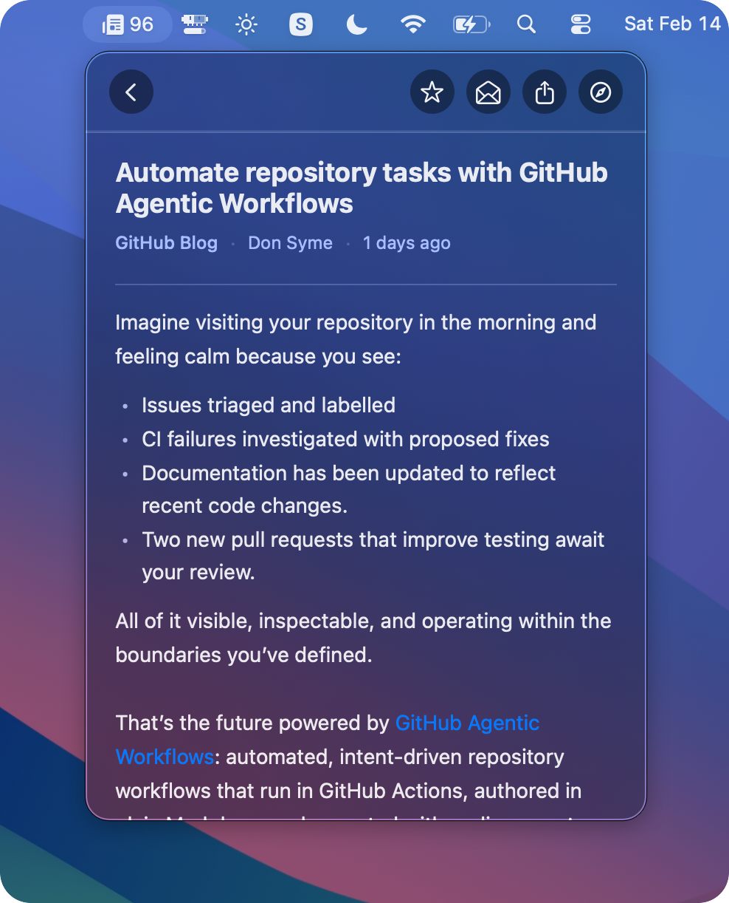
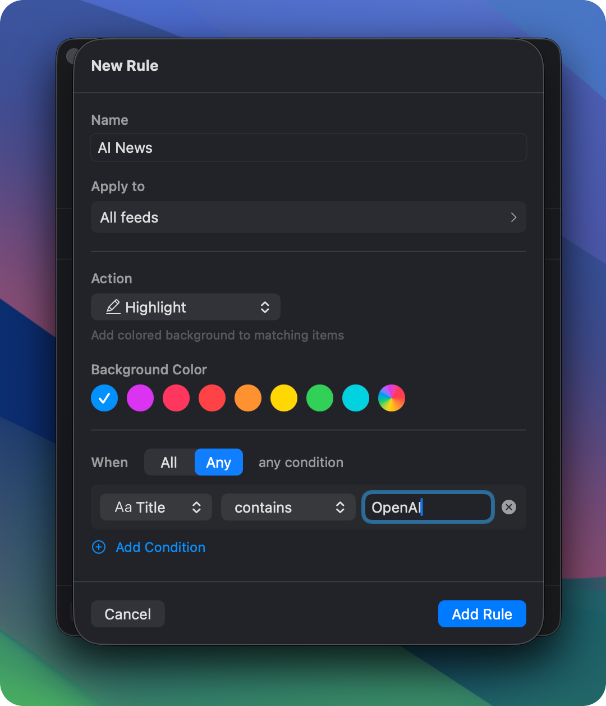

  

# RussReader

A beautiful, lightweight RSS reader that lives in your Mac menu bar. Add any RSS or Atom feed, set up filters, notifications and read articles in or out of the app. 

This was built using [Copilot CLI](https://github.com/features/copilot/cli) inspired by the [Github challange](https://dev.to/challenges/github-2026-01-21)

## Screenshots

  
  

  
  

## Features

- **Private by default** - No tracking (not even for crashs), whatsoever
- **Menu Bar Native** - Sits in your menu bar with an unread count badge, out of the way until you need it
- **Multiple Feeds** - Subscribe to as many RSS/Atom feeds as you want
- **Smart Filters** - Rule-based filters to highlight, hide, auto-star, or send notifications for matching articles
- **Customization** - Customise almost everything from the feeds UI to the behavior
- **Article Preview** - Inline preview with proper HTML rendering including headings, blockquotes, and images
- **Feed Discovery** - Paste any website URL and RussReader finds the feed automatically
- **Authenticated Feeds** - Basic Auth and Bearer Token support, credentials stored securely in Keychain
- **OPML & CSV Support** - Import and export your subscriptions
- **Suggested Feeds** - Curated packs across news, tech, AI, iOS dev, security, and more to get started fast
- **Localization** - Available in English, Spanish (Español), French (Français), German (Deutsch), and Simplified Chinese (简体中文), with per-language content preference
- **Customizable** - Font size, colors, refresh interval
- **Keyboard Shortcuts** - `⌘R` refresh, `⌘,` preferences, `⌘Q` quit

## Installation

### Download (Recommended)

1. Grab the latest `RussReader-amm64.zip` from [Releases](https://github.com/longden/russreader/releases)
2. Open the zip, then drag RussReader to Applications
3. Launch from Applications or Spotlight

### Build from Source

Open `RussReader.xcodeproj` in Xcode and hit Build (`⌘B`). The project uses Swift Package Manager for dependencies, which Xcode resolves automatically on first open.

> Note: `swift run` was used during early development but is no longer supported due to conflicts between SPM and Xcode's dependency resolution.

## Usage

1. Click the newspaper icon in your menu bar
2. Add feeds via Preferences (`⌘,`) → Feeds → `+`, or paste any site URL to auto-detect the feed
3. Click an article to preview it inline, or open it in your browser
4. Right-click to star or mark as read/unread

## Coming Soon

A few things in the works:

- iCloud sync
- AI deduplication of similar articles 
- Full-text search across articles
- More feed packs and categories
- Additional language support

## Contributing

Contributions are welcome. Bug fixes, new features, UI improvements, translations are all fair game. If you're using AI tools to help write code, that's totally fine but make sure you understand enough and stand behind what gets submitted.

To contribute: fork the repo, make your changes, and open a pull request with a clear description of what you've done and why.

## Requirements

- macOS 14.0 (Sonoma) or later
- Xcode 15+ / Swift 5.9+ (for building from source only)

## License

MIT License - see [LICENSE](LICENSE) for details
